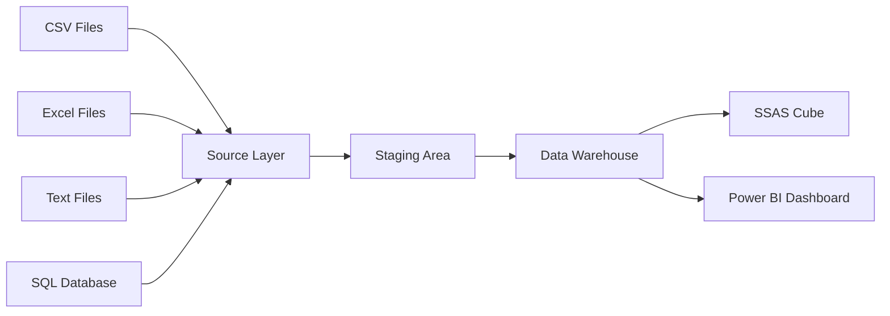

# Retail-Coupon-Redemption-Data-Warehouse-Business-Intelligence-Solution
<div align="center">

# 🚀 Retail Coupon Redemption Data Warehouse & Business Intelligence

### 📊 End-to-End Enterprise Data Warehouse Solution

Transforming **Retail Coupon Redemption Data** into meaningful business insights using the **Microsoft Business Intelligence Stack**.


---

### ⭐ Enterprise Data Warehouse | ETL | OLAP | Business Intelligence

</div>

---

# 📖 Overview

This project demonstrates the implementation of a complete **Data Warehouse & Business Intelligence Solution** using the Microsoft BI ecosystem.

The project converts raw operational retail data into a centralized analytical warehouse capable of delivering powerful business insights through interactive dashboards and OLAP analysis.

✨ **Key Highlights**

- 🏗 Enterprise Data Warehouse
- 🔄 Automated ETL Pipelines
- 📊 Business Intelligence Reporting
- 📈 Interactive Power BI Dashboards
- 🧠 SSAS Cube Development
- 📚 Historical Data Tracking (SCD Type 2)
- ⚡ Accumulating Fact Tables

---

# 📂 Dataset

This project uses the **Predicting Coupon Redemption Feature Selection** dataset from Kaggle.

It contains retail transaction data including:

| Dataset |
|----------|
| 👥 Customers |
| 🎯 Campaigns |
| 🎟 Coupon Redemption |
| 📦 Products |
| 🛍 Transactions |
| 🏷 Product Brands |
| 📂 Categories |

---

# 🏛 Solution Architecture

```text
                   ┌────────────────────┐
                   │ Source Files       │
                   │ CSV • Excel • TXT  │
                   └─────────┬──────────┘
                             │
                             ▼
                   ┌────────────────────┐
                   │ Source Database    │
                   └─────────┬──────────┘
                             │
                             ▼
                   ┌────────────────────┐
                   │ Staging Database   │
                   │ Data Cleansing     │
                   └─────────┬──────────┘
                             │
                             ▼
                 ┌────────────────────────┐
                 │ Data Warehouse         │
                 │ Snowflake Schema       │
                 └─────────┬──────────────┘
                           │
                  ┌────────┴────────┐
                  ▼                 ▼
          ┌─────────────┐    ┌──────────────┐
          │ SSAS Cube   │    │ Power BI     │
          │ OLAP Engine │    │ Dashboards   │
          └─────────────┘    └──────────────┘
```

---

# 📊 Data Flow



---

# ⭐ Data Warehouse Design

✔ Snowflake Schema

### Dimensions

- 👤 DimCustomer
- 📅 DimDate
- 🎯 DimCampaign
- 🎟 DimCouponRedemption
- 📦 DimItem
- 🏷 DimProductBrand
- 📂 DimCategory

### Fact

🛒 FactTransaction

---

# 🔄 ETL Pipeline

Developed using **SQL Server Integration Services (SSIS)**

### Workflow

```text
Extract
   ↓
Validate
   ↓
Transform
   ↓
Clean
   ↓
Load Staging
   ↓
Load Warehouse
```

Features

✅ Data Cleansing

✅ Lookup Transformations

✅ Merge Join

✅ Derived Columns

✅ Conditional Split

✅ Execute SQL Tasks

---

# 📚 Slowly Changing Dimension (Type 2)

Customer Dimension tracks historical changes using

```
Customer

Version 1
StartDate
EndDate
IsCurrent

↓

Customer Address Changed

↓

Version 2
StartDate
EndDate
IsCurrent
```

---

# ⚡ Accumulating Fact Table

Tracks transaction lifecycle

```
Transaction Created

↓

Processing

↓

Completed

↓

Processing Time Calculated
```

Columns

- Transaction Create Time
- Completion Time
- Processing Hours

---

# 🧠 SSAS Cube

Supported OLAP Operations

✅ Roll-up

✅ Drill-down

✅ Slice

✅ Dice

✅ Pivot

---

# 📈 Power BI Dashboards

Included reports

📊 Matrix Report

📊 Multiple Slicers

📊 Drill Down

📊 Drill Through

Features

- KPI Monitoring
- Customer Analysis
- Coupon Analysis
- Sales Trends
- Interactive Filters

---

# 🛠 Technology Stack

| Tool | Purpose |
|------|----------|
| SQL Server | Database |
| SSIS | ETL |
| SSAS | OLAP |
| Power BI | Dashboard |
| SSMS | SQL Development |
| Visual Studio | BI Development |

---

# 📁 Project Structure

```
Retail-Coupon-DWBI/

│

├── datasets/

├── documentation/

├── sql/

├── ssis/

├── ssas/

├── powerbi/

├── screenshots/

├── README.md

└── LICENSE
```

---

# 📸 Project Screenshots

## 🏗 Architecture

```
screenshots/architecture.png
```

## ⭐ Snowflake Schema

```
screenshots/schema.png
```

## 🔄 SSIS Package

```
screenshots/ssis-package.png
```

## 🧠 SSAS Cube

```
screenshots/ssas-cube.png
```

## 📊 Power BI Dashboard

```
screenshots/dashboard.png
```

---

# 🎯 Skills Demonstrated

- Data Warehousing
- ETL Development
- SQL Server
- SSIS
- SSAS
- Power BI
- OLAP
- Data Modeling
- Snowflake Schema
- SCD Type 2
- Business Intelligence

---

<div align="center">

## ⭐ If you like this project, give it a Star ⭐

Made with ❤️ using Microsoft Business Intelligence Stack

</div>
